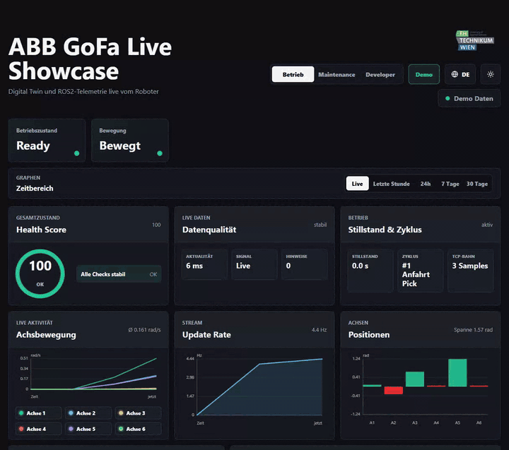
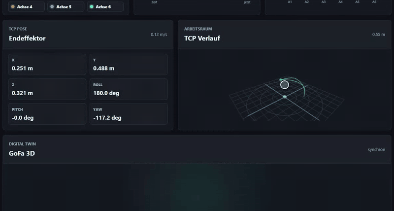
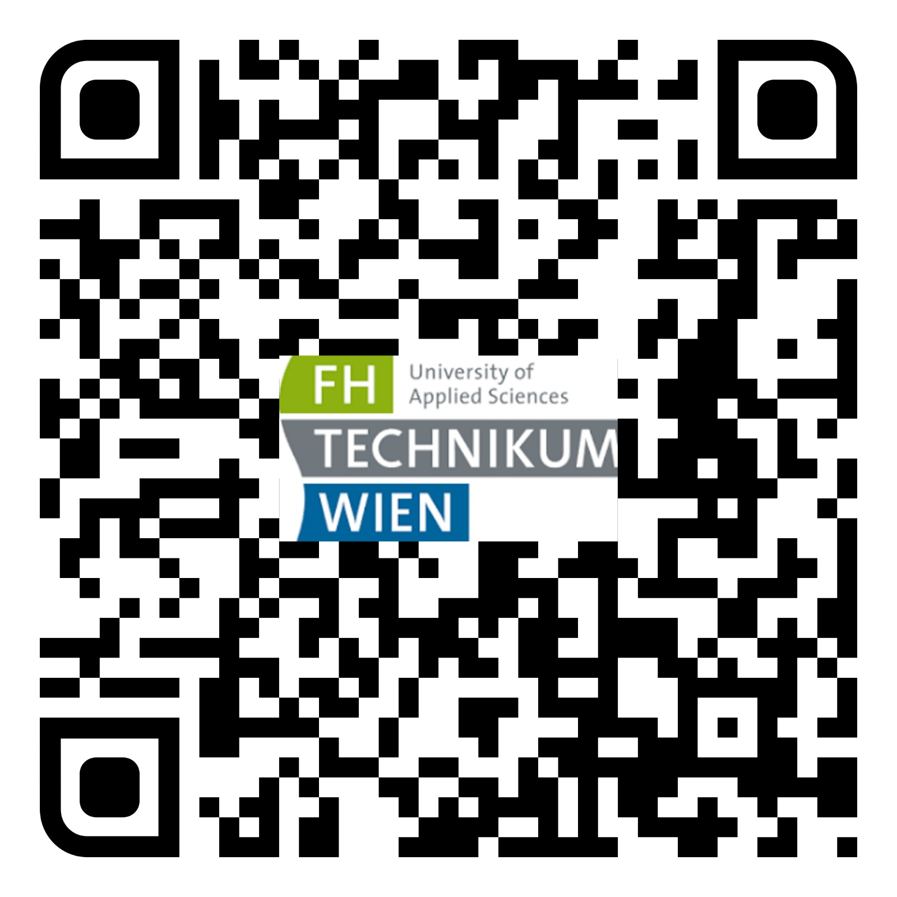
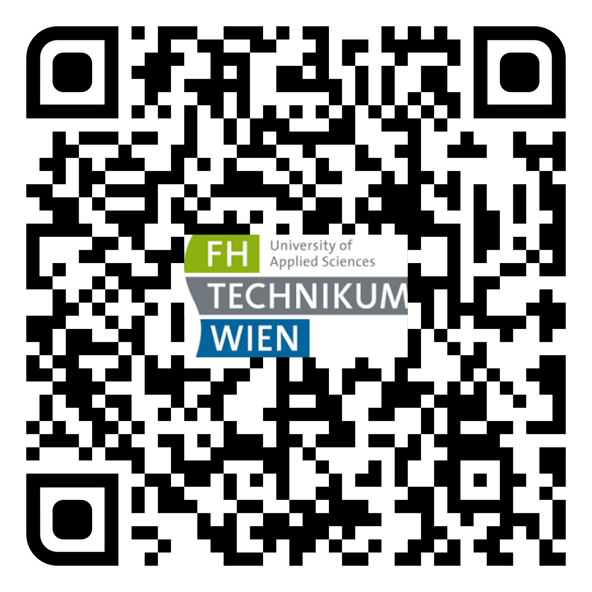
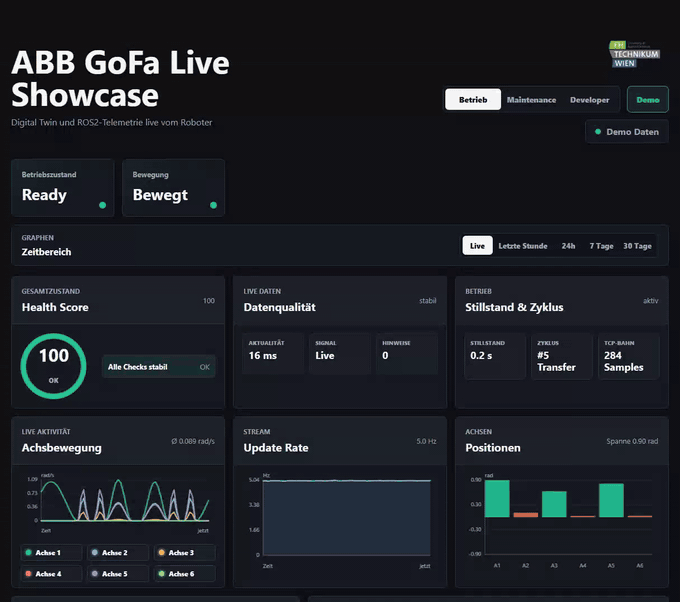
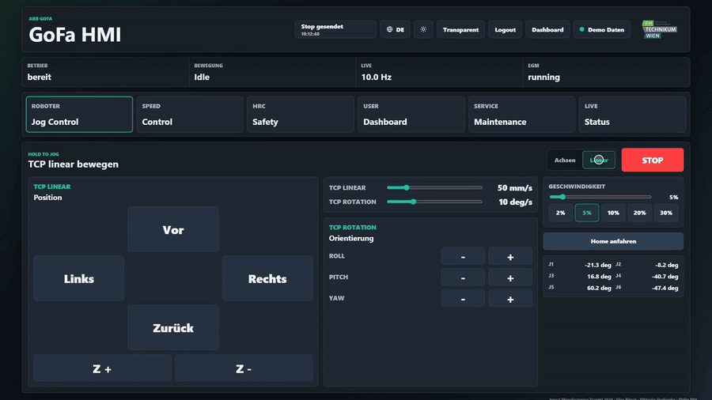
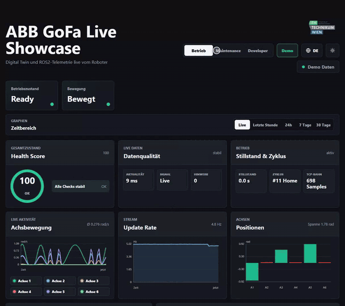

# SMAN ABB GoFa ROS2 Dashboard

Web-Dashboard und Bedien-HMI für einen ABB GoFa (CRB 15000). Die App läuft in Docker, liest ROS2- und EGM-Daten und streamt sie per WebSocket in den Browser, mit 3D Digital Twin, Wartungsauswertung und Jog-Steuerung.





## Live-Demo

Dashboard und HMI laufen als Demo ohne Roboter im Browser. QR-Code scannen oder Link öffnen:

<table>
  <tr>
    <th>Dashboard</th>
    <th>HMI</th>
  </tr>
  <tr>
    <td align="center">
      <a href="https://philip-stack.pages.dev/gofa-dashboard/?demo=1">
        
      </a>
    </td>
    <td align="center">
      <a href="https://philip-stack.pages.dev/gofa-dashboard/hmi?demo=1">
        
      </a>
    </td>
  </tr>
  <tr>
    <td align="center"><a href="https://philip-stack.pages.dev/gofa-dashboard/?demo=1">Dashboard-Demo öffnen</a></td>
    <td align="center"><a href="https://philip-stack.pages.dev/gofa-dashboard/hmi?demo=1">HMI-Demo öffnen</a></td>
  </tr>
</table>

## Funktionen

**Dashboard** (`/`)

- Betrieb: Health Score, Datenqualität, Zyklus, Achsbewegung, TCP-Pose, TCP-Verlauf und 3D Digital Twin
- Maintenance: Trends aus PostgreSQL, Wear Score je Achse, Event-Timeline und Mail-Benachrichtigungen
- Developer: Paketfluss, Topic-Freshness, Latenz und Jitter, EGM-Zustand und JSON-Vorschau der ROS2-Nachrichten



**GoFa HMI** (`/hmi`, Login, für Tablet und Meta Quest ausgelegt)

- Hold-to-Jog für J1 bis J6 und Linear-Jog am TCP über MoveIt Servo
- Speed Control mit Achs-Gauges, Home-Fahrt mit Sicherheitsabfrage, STOP in jedem Panel
- HRC-Safety-Panel, Maintenance- und Status-Übersicht, transparenter Modus für MR-Overlays



**Für beide**

- Deutsch (Standard) oder Englisch über das Globus-Icon, Dark Mode (Standard) oder Light Mode über das Sonne/Mond-Icon
- Demo-Modus ohne Roboter, automatische ROS2-Topic-Discovery, Betrieb parallel zu MoveIt und ABB-Treiber



## Schnellstart

Linux:

```bash
docker compose up -d --build
```

Windows (Docker Desktop):

```powershell
docker compose -f docker-compose.yml -f docker-compose.windows.yml up -d --build
```

Danach im Browser:

| Oberfläche | URL |
|---|---|
| Dashboard | http://localhost:8080 |
| HMI (über HTTPS) | https://localhost:8443/hmi |

Das HMI braucht den HTTPS-Proxy und ein Zertifikat. Wie das eingerichtet wird, steht in [docs/setup.md](docs/setup.md#https-für-das-hmi).

## Demo ohne Roboter

```text
http://localhost:8080/?demo=1       Dashboard mit simuliertem Pick & Place
http://localhost:8080/hmi?demo=1    HMI mit simulierten Achswerten
```

Im Dashboard schaltet auch der Button `Demo` oben rechts auf Demo-Daten um. Im HMI-Demo-Modus werden Jog-, TCP- und Home-Befehle nur im Browser beantwortet und nicht an das Backend gesendet.

## Architektur

```text
Browser (Dashboard / HMI)
  <-> FastAPI + WebSocket (Docker)
  <-> ROS2: /joint_states, /egm/*, /gofa_arm_controller/follow_joint_trajectory
  <-> ros2_control / ABB-Treiber -> EGM -> ABB-Steuerung -> Roboter
```

Das Dashboard belegt den EGM-Port `6511` nicht selbst (`EGM_ENABLE=0`), damit MoveIt und der ABB-Treiber parallel laufen können. Verlaufsdaten liegen in PostgreSQL (`sman-dashboard-db`), ohne Datenbank nutzt das Backend SQLite.

## Dokumentation

| Dokument | Inhalt |
|---|---|
| [docs/setup.md](docs/setup.md) | Docker-Start, Windows, HTTPS für das HMI, Datenbank, Mail-Benachrichtigungen |
| [docs/robot-operation.md](docs/robot-operation.md) | Betrieb am echten Roboter: Netzwerk, EGM, Bridge, MoveIt/RViz, Fehlersuche |
| [docs/reference.md](docs/reference.md) | HMI-Befehle und Endpunkte, Topics und Message-Typen, EGM-Telemetrie, History-API, Assets |

## Projekt

Smart Manufacturing Projekt 2026 an der FH Technikum Wien · Elias Bitsch · Viktoriia Ovdiienko · Philip Stix

Die Visual-Meshes des Digital Twin stammen aus dem ROS-Industrial-Paket [`abb_crb15000_support`](https://github.com/ros-industrial/abb/tree/noetic-devel/abb_crb15000_support). Die Lizenz liegt unter `frontend/robot/abb_crb15000_support/LICENSE`.
